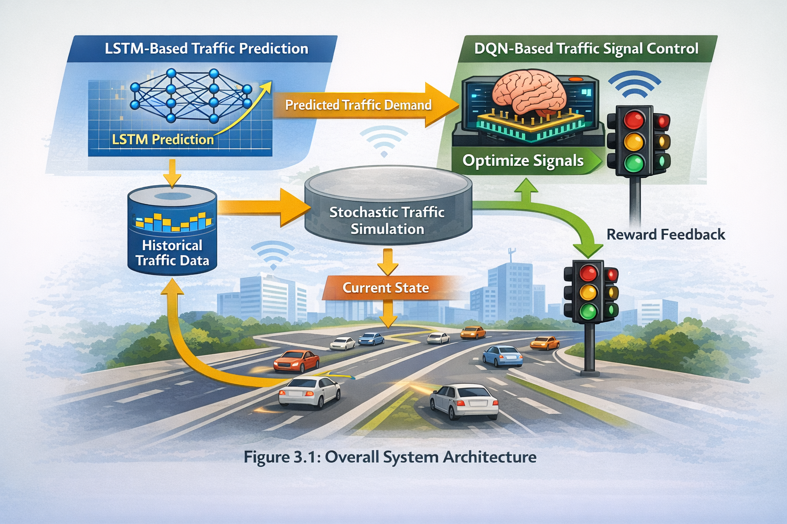

# Smart Traffic Management System (AI-Based)

🚦 An intelligent traffic congestion modeling and simulation platform
developed as part of a Master's thesis in Data Science and Artificial Intelligence.

## 🌐 Live System
https://qasimnorzey.github.io/smart-traffic-management-ai/index.html
## 🧠 Core Technologies
- LSTM for traffic flow prediction
- Deep Q-Network (DQN) for adaptive signal control
- Stochastic traffic simulation
- Web-based interactive dashboard

## 🏗 System Architecture

## 🎯 Academic Context
This system supports the thesis:
"Modeling and Simulation of Traffic Congestion in Smart Cities Using Artificial Intelligence Algorithms"

By Eng. Qasim Norzey
